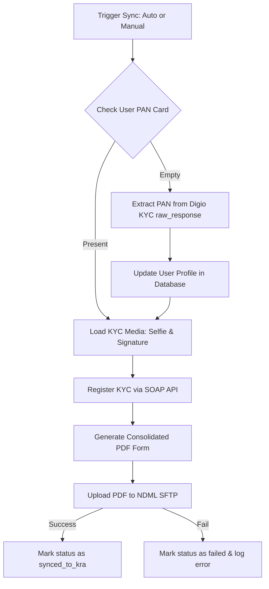

# NDML KRA Sync & Verification Guide

This documentation guides the Administrator on how the **NDML KRA SOAP/SFTP Integration** works, how to monitor customer KRA sync statuses, and how to manually manage uploads and configuration.

---

## 1. Overview
The NDML KRA integration registers approved KYC users with the NDML KRA web service and uploads a consolidated PDF containing:
* Applicant Demographics (Name, Father's Name, DOB, Address, etc.)
* Digio Aadhaar Verification info
* In-Person Verification (IPV) / Live Selfie image
* Signature Specimen image

---

## 2. Admin Dashboard & Monitoring

### Where to monitor KRA statuses:
Admins can monitor and sync KRA statuses from two locations:
1. **KYC Dashboard**: Go to `[your-domain]/admin/customer-analysis/kyc` (Under the **Approved** tab).
2. **Customer Detail Profile Page**: Go to `[your-domain]/admin/users/{userId}`. The sync badge and sync button are displayed at the top-right of the **KYC Verification** card.

### KRA Sync Statuses:
Under the **KRA Sync Status** column, each approved user will have one of the following statuses:

1. **Synced (Green Badge)**:
   * **What it means**: The customer has been registered successfully via SOAP API, and their KYC documents PDF has been uploaded to the NDML SFTP.
   * **Details**: Hover over the green badge to view the timestamp and confirmation message.

2. **Failed (Red Badge)**:
   * **What it means**: The sync process encountered an error (e.g. connection timeout, incorrect credentials, invalid IP, or empty documents).
   * **Details**: Hover over the red badge to view a tooltip with the exact error message (e.g., `SFTP upload failed: Connection timed out`).

3. **Pending Sync (Grey Badge)**:
   * **What it means**: The customer has been approved locally, but their documents have not yet successfully synced to NDML KRA.

---

## 3. How to Sync / Re-upload Manually

If a user is stuck in **Pending Sync** or has **Failed**:
1. Click the **Sync icon** (🔄) in the KYC Dashboard list or on the Customer Detail profile page.
2. Confirm the prompt: `"Are you sure you want to force sync/re-upload KYC documents to NDML KRA for this user?"`
3. The server will run the job synchronously and immediately refresh the page:
   * **If successful**: A green banner saying `KRA documents generated and uploaded successfully` will appear, and the status will update to **Synced**.
   * **If failed**: A red banner explaining the exact error (e.g. `KRA Reupload failed: [error message]`) will appear, and the status will update to **Failed** with the error details.

> [!NOTE]
> **Automatic Recovery for Empty PAN Cards**: If a user's PAN card is empty in their main profile, the sync job will automatically extract the PAN number from their underlying Digio KYC records, update their profile, and complete the sync.

---

## 4. KRA Integration Settings & Credentials

Access settings at:
`[your-domain]/admin/api/kra-settings`

On this page, you can configure:
* **SOAP Web Service URLs**: Endpoints for credentials verification and XML registration.
* **SFTP Connection**: Server host, port, directory path (e.g., `/Image Upload/`), and credentials.
* **Auto-Upload workflow**: If enabled, approved users will automatically be queued for KRA sync.

### Testing Connection:
1. **Test SOAP Credentials**: Click the **Test SOAP Credentials** button. It will verify that your server's IP is whitelisted by NDML and that your SOAP passwords and BP IDs are correct.
2. **Trigger UAT Test Upload**: Click the **Trigger UAT Test Upload** button. It will create a mock customer record with realistic credentials, generate a test PDF, and attempt to register and upload it. Use this to verify that both the SOAP service and SFTP uploads are working end-to-end.

---

## 5. Technical Flow (Under the Hood)

When a sync is triggered, the system runs the `UploadKraDocumentsToSftp` job:

* **Logs**: Detailed execution info and network error dumps are logged in `storage/logs/laravel.log` prefixed with `KRA Job`.
* **PDF Copies**: Generated PDFs are locally archived in `storage/app/kra_pdfs/[Date]/[PAN].pdf` for backup reference.
